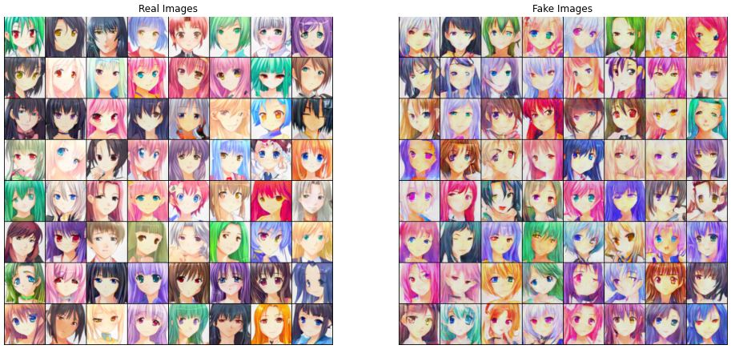
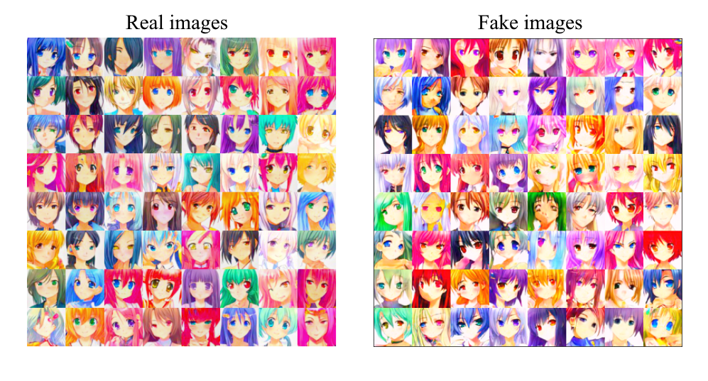

# ganime
#### Introducing cute anime girls to neural networks

Train neural networks for facial features detection and anime characters generation.

### Prerequisites

You have to download `torch`, `torchvision` and `Pillow` packages and the [dataset](https://drive.google.com/file/d/1HG7YnakUkjaxtNMclbl2t5sJwGLcHYsI/view) for training.

## Classifier

Classifying anime girls' eyes and hair using CNN (Convolutional Neural Network)

There are 10 colors for eyes and 12 for hair, counting up 22 features in total.

The CNN was used to build the classyfing model for detecting colors of eyes and hair, working with 98% accuracy on test dataset.

#### Examples of color detection

#### Classifier error over training iterations

#### Accuracy on test dataset

~~~
Average accuracy on test dataset: 98.43064880371094%
Accuracy on test dataset (eyes): 97.98519897460938%
Average accuracy on test dataset (hair): 98.8760986328125%
~~~

 

#### Examples of incorrect classifier guesses

Structure in the repository:
~~~
/-|
  |-classifier-|
               |-classifier.py                 # Python script for training and testing
               |-classifier.ipynb              # Jupyter Notebook for playing with neural network and custom images
               |-data-|                        # Folder with the dataset, it's not included in the repo
               |      |-...
               |-state_dicts-|
                             |-classifier.w    # State dict for ConvNet model
~~~
## GAN

Two architecures were used for character generation: DCGAN (Deep Convolutional GAN) and R1GAN (R1 Regularizer GAN), both of them gave impressive results and fake images were similar to real ones.

### DCGAN

DCGAN was initially used to generate images and the model was trained on 120 epochs for ~3hrs on Tesla V100 GPU

#### Real vs fake images

#### Generator progress over time

Structure in the repository:
~~~
/-|
  |-gan-|
        |-dcgan-|
                |-dcgan.py                      # Python script for training
                |-dcgan.ipynb                   # Jupyter Notebook for playing with neural network and generating images
                |-data-|                        # Folder with the dataset, it's not included in the repo
                |      |-...
                |-state_dicts-|
                              |-dcgan_aniD.w    # State dict for Discriminator model
                              |-dcgan_aniG.w    # State dict for Generator model
~~~

### R1GAN

R1GAN models were also trained and used to generate images, the training process lasted for ~3hrs on Tesla V100 GPU

#### Real vs fake images

#### Interpolation

Structure in the repository:
~~~
/-|
  |-gan-|
        |-r1gan-|
                |-r1gan.py                      # Python script for training
                |-r1gan.ipynb                   # Jupyter Notebook for playing with neural network and generating images
                |-data-|                        # Folder with the dataset, it's not included in the repo
                |      |-...
                |-state_dicts-|
                              |-r1gan_aniD.w    # State dict for Discriminator model
                              |-r1gan_aniG.w    # State dict for Generator model
~~~

## Scores

Inception Score (IS) and Fréchet Inception Distance (FID) were implemented on own Classifier for scoring the quality of generated images.

### Inception Score

|     *Data*    |   *Eyes*  |   *Hair*   |
|:-------------:|:---------:|:----------:|
|     DCGAN     |   4.400   |    5.430   |
|     R1GAN     |   5.747   |    7.198   |
| **Real Data** | **9.855** | **11.459** |

### Fréchet Inception Distance

| *Data* | *Eyes* | *Hair* |
|:------:|:------:|:------:|
|  DCGAN |  0.346 |  0.283 |
|  R1GAN |  0.200 |  0.171 |

A notebook fot score counting in included in the `/scores/` directory.

## Credits

The dataset and data loading source code was provided by [Brian Chao](https://github.com/bchao1/Anime-Generation#the-dataset).

DCGAN architecture was provided by [PyTorch Tutorials](https://pytorch.org/tutorials/beginner/dcgan_faces_tutorial.html).

R1GAN architecture was provided by [Jinhyeok Yang](https://github.com/Yangyangii/GAN-Tutorial/blob/master/CelebA/R1GAN.ipynb).